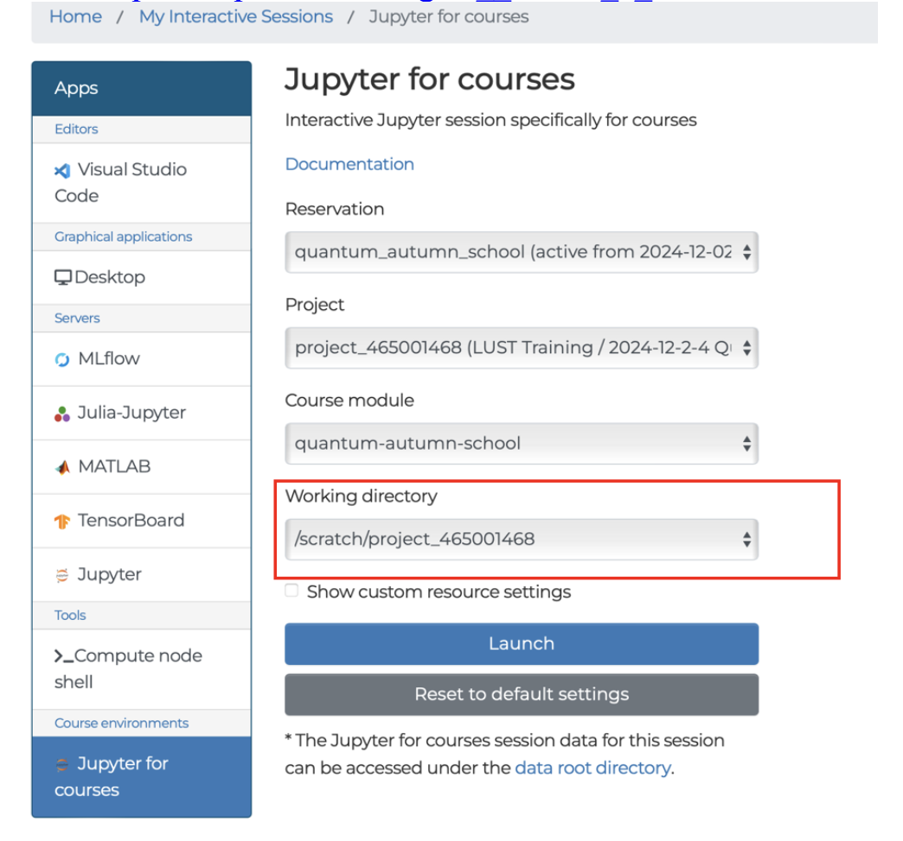
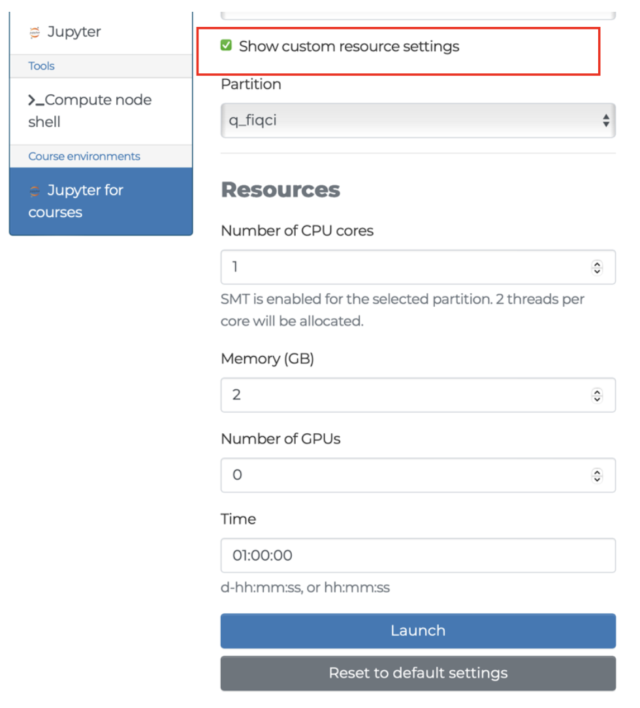
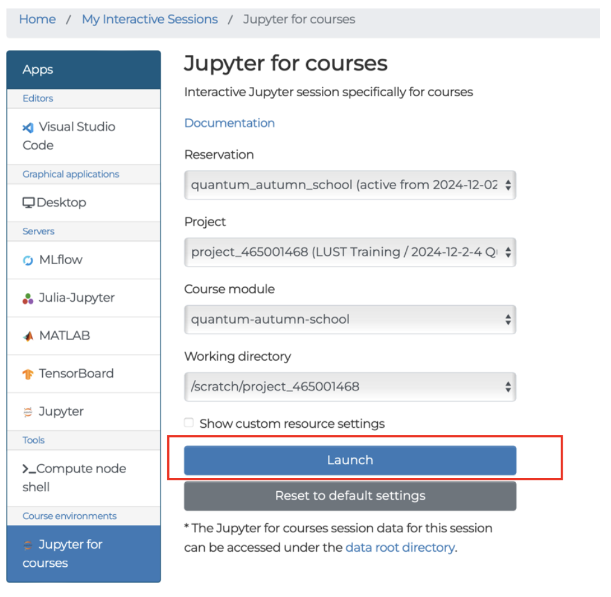
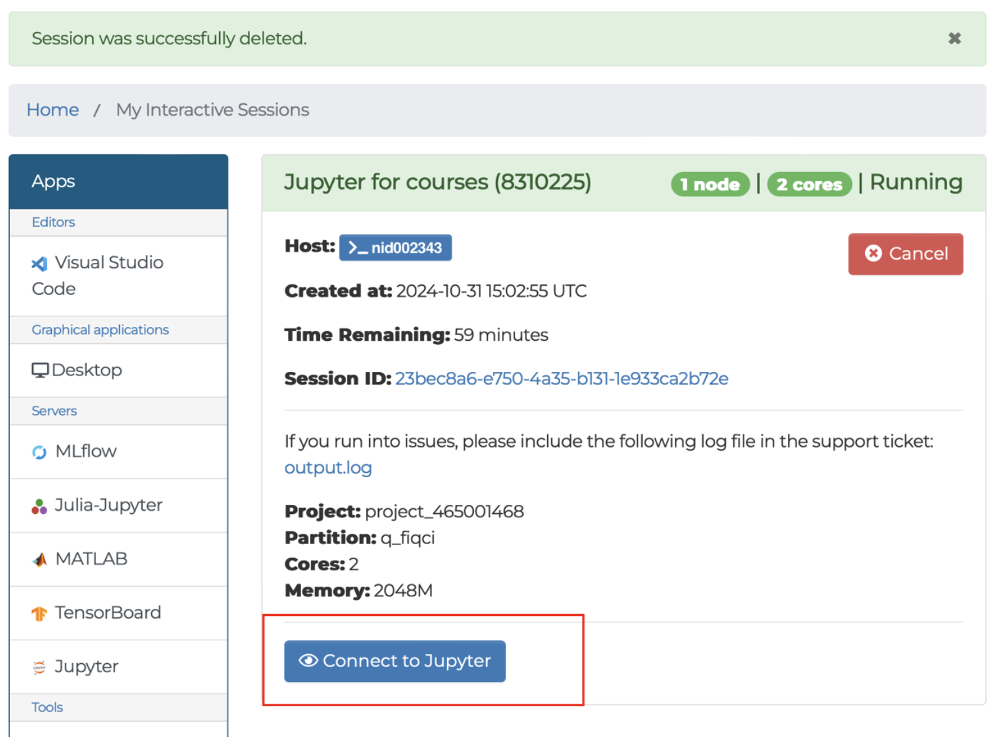

# Setup

Participants can run the course notebooks either on the Helmi quantum computer through the LUMI Open OnDemand platform, or locally on their laptops. Please refer to step by step instructions below to get started!


## Using Helmi via the Custom Quantum Course Environment on LUMI Open OnDemand


A course environment has been made with preloaded modules ([qiskit-iqm](https://iqm-finland.github.io/qiskit-on-iqm/)) and resource settings for connecting to Helmi. This section offers guidance on accessing this environment.

See also these {download}`up-to-date instructions <Introduction-to-QC-Course-env-LUMI-QAS.pdf>`.

1. Log in to [LUMI Open OnDemand / web interface](https://www.lumi.csc.fi/public/) with your MyCSC / Haka account

2. Click on "Jupyter for Courses"


3. You should get a prefilled page shown below, you can change a few variables such as your “working directory”.

   - Please note what you selected as your working directory when launching your Jupyter Notebook as this will determine where your file is saved.
   - You can find more information about storage on LUMI here: https://docs.lumi-supercomputer.eu/storage/#__tabbed_1_1
  
  

4. You also have the flexibility to adjust some resource settings. By clicking “show custom resource settings”(Please note that memory should be kept under 3GB and the partition should always be `q_fiqci`).

  

5. Once you are ready, click on Lunch.

  

6. Depending on the queue, it might take a few minutes before you can access your session. Once your session is ready, you should see a page like this:

  

7. Click on the big blue “Connect to Jupyter” button and it will launch a Jupyter notebook on a separate tab. Navigate to the new tab.

8. Now you can create and run codes on a jupyter notebook. A sample is shown in the image below.

  

9. You can save your notebooks like this:

   - go to the top left corner, click on file
   - click on `Save notebook` to save a specific file or `Save all` to save all file & changes

10. This environment gives each user 2 hours and 2GB per session. It is configured to load the helmi_qiskit (qiskit-iqm) module and use the q_fiqci partition to connect to Helmi.

**Useful Links**

- https://fiqci.fi/_posts/2024-08-23-Lumi_web_introduction
- https://docs.csc.fi/computing/quantum-computing/helmi/running-on-helmi/


---

## Locally with your laptop

All of the course contents can be followed along locally on your laptop. Each tutorial will provide installation instructions. 

If you already have a preferred way to manage Python versions and libraries, you can stick to that. If not, we recommend that you install Python3 and all libraries using [`miniconda`](https://docs.conda.io/en/latest/miniconda.html) a free minimal installer for the package, dependency and environment manager for [`conda`](https://docs.conda.io/en/latest/index.html>).

Please follow the installation instructions on [https://docs.conda.io/en/latest/miniconda.html](https://docs.conda.io/en/latest/miniconda.html) to install Miniconda3.

Make sure that both Python and conda are correctly installed:

```console
$ python --version
$ # should give something like Python 3.11.7
$ conda --version
$ # should give something like conda 24.9.2
```

A `requirements.txt` file is provided which contains all of the python packages to install a local software environment on your computer. Using this a `conda` environment can be created using the command:

```console
$ conda create --name qas2024 -y python=3.11.7 pip
```

Which creates a new conda environment with Python 3.10 and `pip`. You can then activate it and install the python packages:

```console
$ conda activate qas2024
$ pip install -r requirements.txt
```

You can download the `requirements.txt` [here](requirements.txt).


## (Backup approach) [Notebooks.csc.fi](https://notebooks.rahtiapp.fi/welcome)

CSC's notebooks platform provides a preconfigured python environment and jupyter-lab server for running all of the jupyter notebooks shown in this course. **No setup is required** to run the notebooks. 

Please find {download}`instructions here <Introduction-to-CSC-Noppe-QAS.pdf>`.

