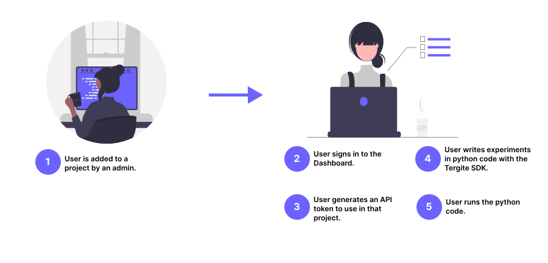
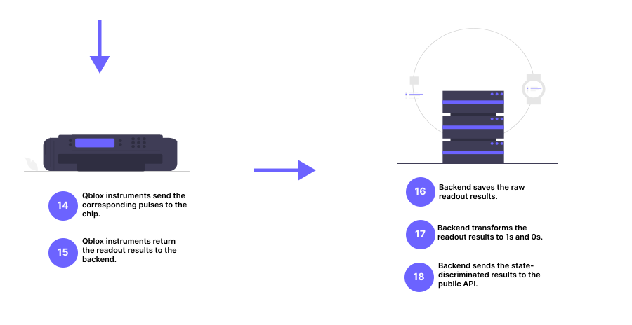

# Tergite overview

{download}Slides <slides/qas-24-tergite-overview.pdf>

## Contents

- [What is Tergite?](#what-is-tergite)
- [Why is Tergite necessary?](#why-is-tergite-necessary)
- [What can I do with Tergite?](#what-can-i-do-with-tergite)
- [How does Tergite work?](#how-does-tergite-work)
- [Test out Tergite](#test-out-tergite)

## What is Tergite?

Let's take a walk down memory lane to the time when classical computers were large expensive machines that could only be afforded by large corporations.
Back then, batch processing enabled multiple users in a given company to share a single computer.

```{figure} ./img/operator-working-on-mainframe.jpg
:alt: An operator working on old mainframe

An operator working on an old mainframe
```

Quantum computing is at a similar stage today. Quantum computers are large expensive machines that can only be operated by a select few.
There is need for specialized software to give multiple users simplified access to a single quantum computer.

[Tergite](https://tergite.github.io/) is one such collection of software that enables a quantum computer experimentalist to:

- Submit experiments to the quantum computer's queue.
- Retrieve results of completed experiments
- Monitor the device parameters of the quantum computer

Just like in the batch processing of old, the quantum computer requires an operator.  
Through Tergite, an operator of a quantum computer can do the following:

- (Re)calibrate the quantum computer
- Turn on/off the quantum computer
- Manage experimentalists' access to the quantum computer

## Why is Tergite necessary?

### 1. Operation of a quantum computer requires a highly specialized skillset.

Most quantum computers of today are very complex machines that require specialized care in a lab environment.
The skillset required to operate such machines takes many years of postgraduate studies to master.

Tergite gives experimentalists, who don't have this skill, access to the quantum computer to run experiments on it.

### 2. Quantum computers need frequent recalibration

One characteristic of today's quantum computers is the fact that their device parameters drift with time.
Temperature changes, cosmic radiation, aging of electronics, mechanincal vibrations etc. cause the
device parameters of the quantum computers to change with time.

[Tergite autocalibration](https://github.com/tergite/tergite-autocalibration/) is library used to recalibrate quantum computers. It is part of the Tergite stack.

### 3. Idle time on a quantum computer is very expensive.

A typical quantum computer today costs more than half a million euros (€500,000).
Every second a quantum computer lies under-utilized, a lot of money is being thrown down the drain.
Batching experiments from multiple experimentalists is an attempt to make sure the quantum computer is in use at all times.

## What can I do with Tergite?

### 1. Access the WACQT quantum computer

The Wallenberg Center for Quantum Computing (WACQT) is a Swedish national research programme with a focus on quantum technology.
One of its major goals is to create a quantum computer that is accessible to Swedish researchers and WACQT industrial partners.
The WACQT quantum computer is physically housed at [Chalmers University of Technology](https://www.chalmers.se/)
and is operated by [Chalmers Next Labs AB](https://chalmersnextlabs.se/).

```{figure} ./img/wacqt-quantum-computer.jpeg
:alt: The WACQT quantum computer

The WACQT quantum computer laboratory
```

In order to access this quantum computer via the internet, one has to go through the Tergite stack running at [QAL 9000](https://www.qal9000.se).

Interacting with the WACQT quantum computer requires the use of the [Tergite software development kit (SDK)](https://pypi.org/project/tergite/).

### 2. Calibrate superconducting qubit chips

If one has a superconducting quantum chip with a design similar to the WACQT quantum computer chip, it is possible to
calibrate this chip using the [Tergite autocalibration](https://github.com/tergite/tergite-autocalibration/) library.
Doing this requires substantial hardware and software know-how.

[Chalmers Next Labs AB](https://chalmersnextlabs.se/) currently offers a service to calibrate such chips for Swedish Small and Medium Enterprises (SMEs).

### 3. Expose a physical quantum computer to the internet

The entire Tergite stack can be run in front of a physical quantum computer to expose it to a select group of
experimentalists. It contains Identity Access Management (IAM) to handle authorization of only members of a
given organization. Any organization can use Tergite to spin up a cloud offering for their quantum computers.
The Tergite stack is open source and free to use or extend under the [Apache 2.0 License](https://github.com/tergite/tergite/blob/main/LICENSE.txt).

However, there are a few requirements for Tergite to work well:

- The quantum chip should be a superconducting with a similar design to the WACQT quantum computer chip designas described by Kosen et al. in the ["Signal Crosstalk in a Flip-Chip Quantum Processor"](https://journals.aps.org/prxquantum/abstract/10.1103/PRXQuantum.5.030350) article.
- The quantum computer should be controlled by [Qblox instruments](https://www.qblox.com/)

## How does Tergite work?

```{figure} ./img/tergite-data-flow.png
:alt: Data flow diagram of Tergite

Data flows in Tergite
```

### Components of the stack

Tergite is composed of four main components:

#### [Backend](https://github.com/tergite/tergite-backend)

The operating system of the quantum computer. Its basic functions include:

- Transpiling [OpenPulse](https://arxiv.org/abs/1809.03452) job definitions to [Quantify Schedules](https://quantify-os.org/docs/quantify-scheduler/dev/tutorials/Schedules%20and%20Pulses.html) that can be understood by the Qblox control instruments.
- Queuing jobs so that the quantum chip can receive one job at a time.
- Saving the device parameters of the quantum chip, after (re)calibration.

#### [Frontend](https://github.com/tergite/tergite-frontend)

The public interface through which users on the internet interact with the quantum computer. It consists of:

- [RESTful API](https://github.com/tergite/tergite-frontend/tree/main/apps/tergite-mss)
  : The programmatic interface through which scripts and other computer programs interact with the quantum computer

- [Dashboard](https://github.com/tergite/tergite-frontend/tree/main/apps/tergite-dashboard)
  : The web-based graphical interface through which users interact with the quantum computer

#### [Software Development Kit (SDK)](https://github.com/tergite/tergite)

The Library which eases writing of python scripts and programs that interact with the quantum computer.
It is based on [Qiskit](https://github.com/Qiskit/qiskit) and communicates with the backend using [OpenPulse](https://arxiv.org/abs/1809.03452) sent via HTTP/HTTPS

#### [Automatic Calibration Tool](https://github.com/tergite/tergite-autocalibration)

The Command Line Interface (CLI) used to determine the device parameters of the quantum computer.

### Basic Flow






## Test out Tergite

It is possible to test out a live instance of Tergite by using the [QAL 9000 quantum computer](https://www.qal9000.se/).
However, someone from WACQT must have given you permission to use it because it is not open to the general public.

It is also possible to run Tergite on your own computer.
The only catch is that you will only be able to run your experiments on simulators.
Instructions on how to run Tergite locally are found in the [Tergite quick start tutorial](https://tergite.github.io/tutorials/01_quick_start.html).
